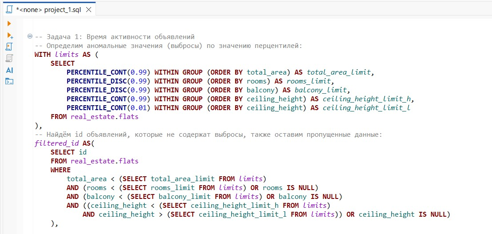

# Проект Анализ рынка недвижимости
## Бизнес-контекст
Агентство недвижимости из Петрозаводска планирует выйти на рынок Санкт-Петербурга и Ленинградской области и перевести основной офис в новый регион.
Агентству нужен готовый анализ объявлений о продаже жилой недвижимости в Санкт-Петербурге и Ленинградской области, чтобы найти самые перспективные сегменты недвижимости.
## Цель проекта  
Провести анализ объявлений о продаже жилой недвижимости в Санкт-Петербурге и Ленинградской области, разработать дашборд, чтобы поможете заказчику спланировать бизнес-стратегию, выбрать сегмент недвижимости с высоким спросом и подходящий сезон для публикации объявлений.  
## Задачи:
- познакомиться с данными, подключившись к базе с помощью DBeaver
- решить аналитические ad hoc задачи с помощью SQL-запросов и сформулировать выводы в виде небольшой аналитической записки
- разработать дашборд

Основные инструменты - `sql, Yandex DataLens`.

